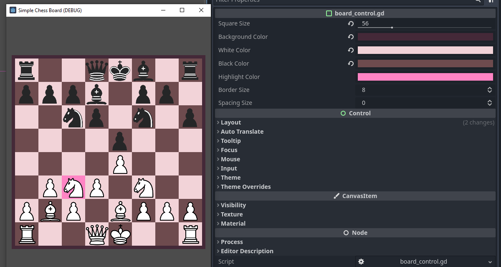

This project was a starting point for my chess game Master of Chess. Check it out on steam here:
https://store.steampowered.com/app/2248900/Master_of_Chess/

  

# Simple Chess Board

A Godot 4.0 Chess board component.

Based on a lovely repo by Andrew Wilkes: https://github.com/andrew-wilkes/godot-chess but heavily simplified (no user input)

The board is designed to only accept **set_fen** and **highlight_square** methods.

Chess pieces from wikicommons: https://commons.wikimedia.org/wiki/File:Chess_Pieces_Sprite.svg#/media/File:Chess_Pieces_Sprite.svg
